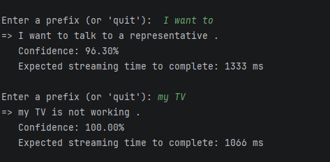
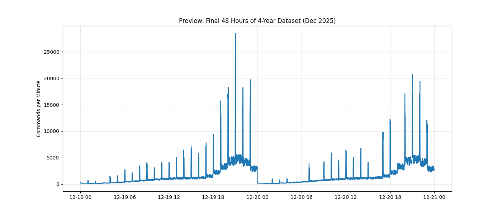
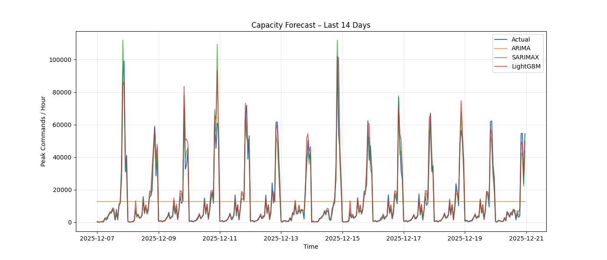
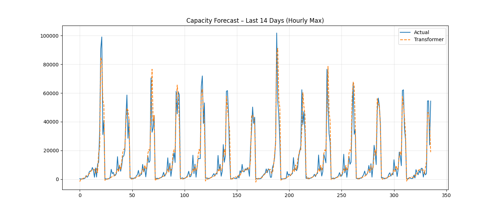

# Projects Descriptions

### This suite of projects extends our previous research and innovations during daily work. 

I have downsized the neural network architectures and datasets in these demos so users can perform training and inference efficiently on an NVIDIA RTX 5090 (Blackwell) GPU for optimal performance. While CPU training and inference are supported, please note that training may take several hours or even days due to hardware limitations. If a discrete GPU is unavailable, use the requirements.cpu.txt file to set up your environment.

## Project Demo 1: User Query Prediction and EOS Detection (model part) (2019-Present)

**Environment:** PyTorch 

**Models Trained:** Distance and Vocabulary Embeddings, PyTorch Transformer

**Business Needs:** For hands-free devices, the system often needs to wait for a relatively long period to determine whether the user has finished speaking, which can lead to a sluggish user experience. To mitigate this, we use predictive models to estimate when a user’s command will end and what the command is likely to be, allowing us to begin processing the request ahead of time. Once the actual utterance is confirmed, the VREX result is already prepared and can be returned immediately.

**Focuse Areas:** Probability Loop, Causal Mask

**Project Directory:** [`generative/sentence_prediction`](./generative/sentence_prediction)

## Project Demo 2: Chronological Audio Classification (Audio Cache) (2017-Present)

**Environment:** PyTorch, 

**Business Needs:** We observed that popular short queries—such as “YouTube” or “tune to CNN”—account for a large portion of voice remote traffic. Instead of routing these requests through the full ASR pipeline, we directly generate a mel-spectrogram for the short utterance and use a lightweight classifier to determine whether (and which) popular query it matches. This approach delivers near-instant response times and significantly higher accuracy than traditional ASR systems, which often struggle with very short utterances.

For demo purposes, we use publicly available image data to stand in for the actual mel-spectrograms derived from user utterances.

**Models Trained:** CNN, ResNet (CNN), Wav2Vect (Transformer)

**Focuse Areas:** Evaluated performance gains by migrating from traditional convolutional architectures to state-of-the-art Wave2Vec transformer-based self-supervised models.

| Model          | Accuracy  | Avg Precision | Avg Recall |
|----------------|-----------|---------------|------------|
| SpeechCNN      | 97.37%    | 97.38%        | 97.37%     |
| ResNet18_Opt   | 97.57%    | 97.59%        | 97.55%     |
| **Transformer**| **98.87%**| **98.87%**    | **98.86%** |

**Project Directory:** [`supervised`](supervised)

## Project Demo 3: Scalable NLU Audit via Semantic Compression (2025 - Present)

**Environment:** PyTorch, OpenAI, Hybrid Pipeline (Classical ML + Generative AI)

**Business Needs:** In our IVR system, we need to map user utterances to predefined intents. However, the system contains thousands of intents, each with detailed descriptions, examples, and multiple versions, making it impractical to rely solely on an LLM for direct intent selection.

To address this, we built a vector-based retrieval system to narrow the search space to a small set of candidate intents, and then use an LLM to make the final determination. A key challenge is that FAISS performs poorly on very short utterances (fewer than three words). To overcome this, we designed two separate vector systems: one that matches short utterances against example phrases for each intent, and another that matches longer utterances against full intent definitions. The LLM then evaluates the combined candidate set to select the best-fitting intent.

**Models Used:** SentenceTransformer (SBERT), MiniBatchKMeans, GPT-5o-mini (Audit)

**Focuse Areas:** Designed a high-throughput pipeline to process 1M+ utterances by condensing raw text into 100 behavioral archetypes, reducing LLM token costs by 99.9%.
Hybrid Analysis Engine: Combined local GPU-accelerated embeddings (PyTorch) for large-scale data structuring with LLM-as-a-Judge logic for nuanced semantic auditing.

**Project Directory:** [`adv_analysis_utterance_classifier`](adv_analysis_utterance_classifier)

Excution Result:
    
    User utterance: "Wi - Fi issues"
    Intent: internet_troubleshoot
    Confidence: 0.9
    Path: faiss+rag+llm

    User utterance: "sure"
    Intent: small_talk_confirmation_yes
    Confidence: 1.0000001
    Path: short utterance vec matching

    User utterance: "I have to do everything stay on the phone make a call I don't have to tell you what to do you're the 1 who you"
    Intent: no match
    Confidence: 0.33603161573410034
    Path: unknown (low_similarity)

## Project Demo 4: GPU Capacity Prediction and Planning (2017 - Present)

**Environment:** PyTorch, ARIMA, Transformer

**Business Needs:** Voice remote traffic is highly variable, exhibiting clear minute-by-minute, hourly, daily, weekly, and seasonal patterns. 
It is also closely tied to popular TV shows airing at the time. 
Accurately predicting future user traffic is critical for determining system resources such as replicas and alerts. 
To achieve this, we leverage both traditional ARIMA (SARIMAX), Light GBM models and modern transformer-based models for traffic forecasting.

For privacy reasons, the data used in this demo is synthetic and derived from publicly available datasets rather than real production data.

**Project Directory:** [`capacity_planing`](capacity_planing)

  
 
  

  

## Project Demo 5: Comparative Study of Generative Image Models (2019-2023)

**Environment:** PyTorch

**Business Needs:** When a new voice device is released, we need to retrain our voice models (wake-word spotting and ASR) using utterances that reflect the device’s new acoustic characteristics. However, early on, we typically don’t have sufficient real data. To address this, we use synthetic data generation tools to create additional utterances that simulate the device’s behavior. For privacy reasons, the demo uses images instead of voice spectrograms.

**Models Trained:** Conditional GAN (cGAN), Wasserstein GAN (WGAN-GP), Diffusion Models

**Focuse Areas:** Model Stability, Interaction Between Label and Noise Dimenstions

**Project Directory:** [`unsupervised-learning/diffusion_gan_comparison`](./unsupervised-learning/diffusion_gan_comparison)

<table border="0">
  <tr>
    <td align="center">
       
      <b>Conditional GAN</b>
    </td><td width = 5 />
    <td align="center">
       
      <b>WGAN‑GP</b>
    </td><td width = 5 />
    <td align="center">
       
      <b>Diffusion Model</b>
    </td>
  </tr>
</table>