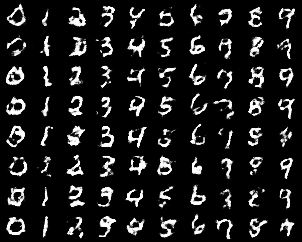
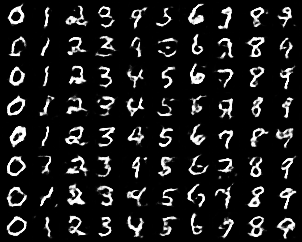
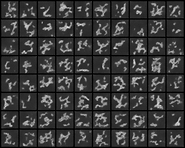

# Comparative Study of cGAN, WGAN‑GP, and Diffusion Models

## Overview
This project implements and compares three major generative modeling approaches—**Conditional GAN (cGAN)**, **Wasserstein GAN with Gradient Penalty (WGAN‑GP)**, and **Diffusion Models**—to understand how different architectures learn data distributions, handle conditioning, and produce synthetic images.

All models are trained on the same dataset under consistent settings to highlight differences in stability, controllability, and sample quality.

<table border="0">
  <tr>
    <td align="center">
       
      <b>Conditional GAN</b>
    </td><td width = 5 />
    <td align="center">
       
      <b>WGAN‑GP</b>
    </td><td width = 5 />
    <td align="center">
       
      <b>Diffusion Model</b>
    </td>
  </tr>
</table>

---

## Purpose of the Project
This project demonstrates how different generative paradigms behave when solving the same task. By comparing cGAN, WGAN‑GP, and Diffusion Models, we gain insight into:

- Training stability  
- Quality and diversity of generated samples  
- How conditioning affects generation  
- Practical trade‑offs between GANs and diffusion models  

The result is a concise, reproducible framework for understanding the evolution and capabilities of modern generative AI.

---

## Why These Models?

### **Conditional GAN (cGAN)**
A classic adversarial model that generates images conditioned on labels.  
Useful for studying:
- Controlled generation  
- How GANs use label information  
- Common GAN issues like mode collapse  

### **WGAN‑GP**
A more stable GAN variant that uses the Wasserstein distance and gradient penalty.  
Included to show:
- Improved training stability  
- More meaningful loss curves  
- Better sample diversity compared to standard GANs  

### **Diffusion Models**
A modern, non‑adversarial generative method based on iterative denoising.  
Included because:
- They avoid adversarial instability  
- They produce high‑fidelity, diverse samples  
- They represent the current state of the art  

